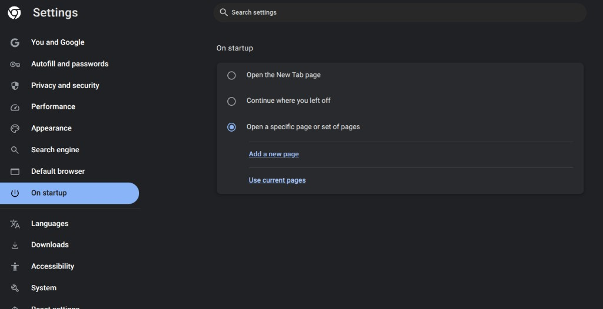
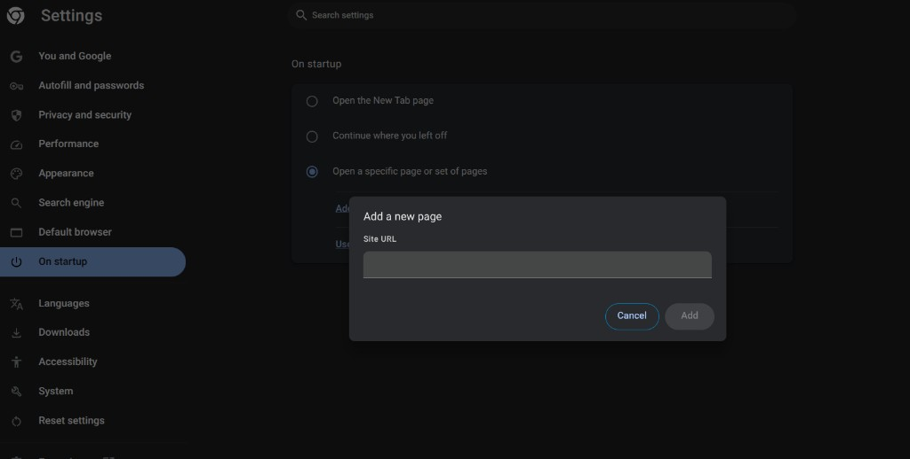

# lorenn-productivity-kit

Proyecto HTML para juntar las herramientas de productividad que uso. Está pensado como página de inicio del navegador.

Abrir `index.html`.

## Chrome

1. Ir a `chrome://settings/onStartup`
2. Elegir **Open a specific page or set of pages**
3. Elegir **Add a new page**
4. Pegar la URL de `index.html` y confirmar con **Add**

En local, la URL es la ruta del archivo. Por ejemplo: `file:///ruta/lorenn-productivity-kit/index.html`

## Proyecto

La página de inicio muestra `Hola, Nombre!` y atajos a TimeTill y Pomodoro.

El nombre se lee de `settings.js`. `settings.example.js` es la plantilla. En `settings.js` el nombre es Lorenzo.

- **TimeTill**: elegir una hora y ver el tiempo que queda hasta ese momento, con una barra de progreso.
- **Pomodoro**: temporizador de 25 minutos.
